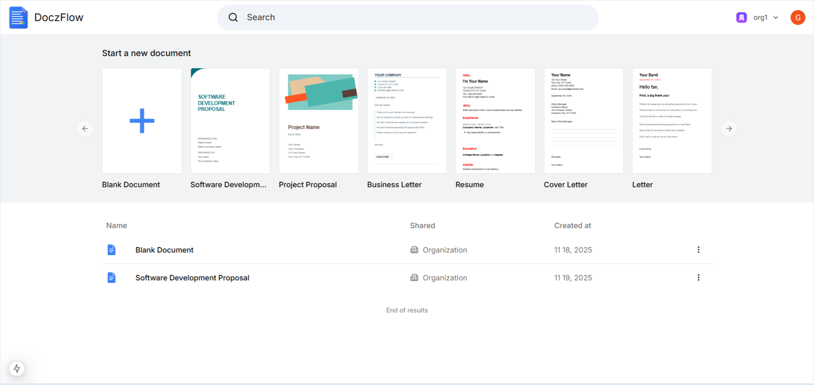
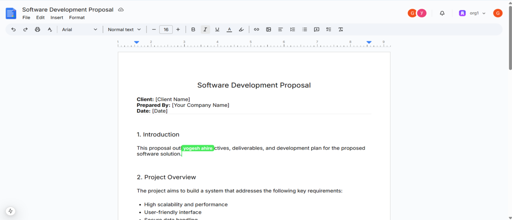
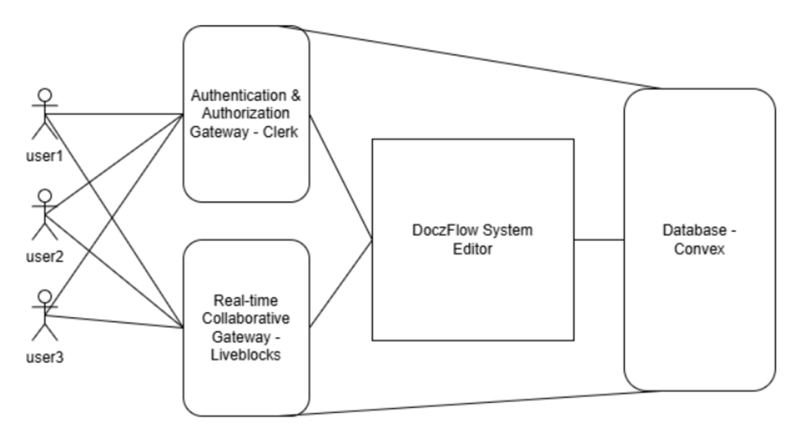

<h1 align="center">DoczFlow – Real-Time Collaborative Document Editor</h1>

<p align="center">
  
  
  
  
  
  
  
</p>

DoczFlow is a **real-time collaborative document editing platform** that enables multiple users to create, edit, and collaborate on documents simultaneously.

It provides **live synchronization, shared workspaces, mentions, comments, and organization-based access control**, making it suitable for team collaboration and knowledge management.

The platform demonstrates modern **real-time system design and full-stack development practices** using modern web technologies.

---

# Live Demo

🔗 https://collaborative-tool-lake.vercel.app

---

# Features

### Real-Time Collaborative Editing
Multiple users can edit the same document simultaneously with live synchronization.

### Live Presence Indicators
Shows active collaborators with real-time cursor updates and presence indicators.

### Mentions and Comments
Collaborators can mention other users and add comments inside documents.

### Organization-Based Workspaces
Documents can be organized and shared within teams or organizations.

### Secure Authentication
User authentication and identity management handled via Clerk.

### Rich Text Editing
Modern rich text editing experience powered by TipTap.

---

# Application Screenshots (Live Demo)

### Document Dashboard

<p align="center">
  
</p>

### Collaborative Editor

<p align="center">
  
</p>

---

# Tech Stack

### Frontend
- Next.js
- React
- TypeScript
- Tailwind CSS

### Editor
- TipTap (ProseMirror based)

### Real-Time Collaboration
- Liveblocks

### Backend
- Convex

### Authentication
- Clerk

### Deployment
- Vercel

---

# System Architecture
The following diagram shows the high-level architecture of DoczFlow.

<p align="center">
  
</p>

---

# Installation & Setup

Clone the repository

```bash
git clone https://github.com/Yogesh-ahire/Collaborative-Tool.git
```
Move to project folder
```bash
cd Collaborative-Tool
```
Install dependencies
```bash
npm install
```
Run development server
```bash
npm run dev
```
Run Convex server
```bash
npx convex dev
```

Open in browser

http://localhost:3000


## Environment Variables

Create a `.env.local` file
```bash
NEXT_PUBLIC_CONVEX_URL=
NEXT_PUBLIC_CLERK_PUBLISHABLE_KEY=
CLERK_SECRET_KEY=
LIVEBLOCKS_SECRET_KEY=
```
---

# Future Improvements

- Document version history
- AI-powered document assistant
- Advanced role-based access control

---

# Author

Yogesh Ahire

🔗 GitHub: https://github.com/Yogesh-ahire  
🔗 LinkedIn: https://linkedin.com/in/yogesh23-ahire


## License

This project is built for educational and portfolio purposes.